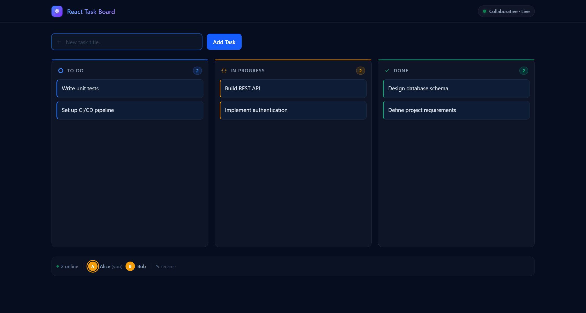

# Collaborative Task Board

A real-time collaborative Kanban board where multiple users can manage tasks together — drag tasks between columns, see live presence of teammates, and watch changes appear instantly across every connected browser.

## Live Demo

[https://react-task-board-pied.vercel.app](https://react-task-board-pied.vercel.app)

## Screenshot



*Tasks spread across To Do, In Progress, and Done columns with live presence shown at the bottom.*

## Features

- **Named user presence** — enter your name when you join; teammates see your name in the connected users panel
- **Real-time sync** — every task add, move, or delete is broadcast instantly to all connected browsers via Socket.io
- **Drag-and-drop** — powered by [@atlaskit/pragmatic-drag-and-drop](https://atlassian.design/components/pragmatic-drag-and-drop), with precise closest-edge drop indicators for intra-column reordering
- **Live editing awareness** — hovering a task broadcasts your presence so teammates see who's looking at a card
- **Per-column task creation** — each column has an inline "+ Add a task…" input at the bottom; press Enter to add instantly
- **Task details modal** — click any task card to open a modal and edit its title, description, assignee, and due date
- **Search** — compact search bar filters tasks across all columns in real time
- **Confirmation dialog** — a compact inline dialog asks "Delete task?" before removing a card, preventing accidental deletes
- **Undo delete** — after confirming, a 5-second undo toast lets you recover the task immediately
- **Rename yourself** — change your display name at any time with the ✎ rename button
- **Connection status** — green pulse when live, red indicator when the server is unreachable
- **Dark professional UI** — column accent bars, straight left border on task cards, smooth transitions

## Tech Stack

| Layer | Library / Tool |
|---|---|
| UI framework | React 19 |
| Language | TypeScript 5.8 |
| Styling | Tailwind CSS 4 (Vite plugin, no config file) |
| Drag and drop | @atlaskit/pragmatic-drag-and-drop 1.4 |
| Real-time | Socket.io (client + server) |
| Build tool | Vite 6 |
| Testing | Jest + React Testing Library |
| Dev runner | concurrently (Vite + socket server in one command) |

## Getting Started

```sh
npm install
npm run dev
```

`npm run dev` starts both the Vite frontend and the Socket.io server together. Open `http://localhost:5173` in multiple browser tabs to see real-time collaboration.

The socket server runs on port **3001**. If you need a different URL, set `VITE_SERVER_URL` in a `.env` file:

```
VITE_SERVER_URL=http://localhost:3001
```

## Running Tests

```sh
npm test
```

Unit tests cover all components and the board context using Jest and React Testing Library.

## Project Structure

```
src/
  components/     UI components (Board, Column, Task, TaskModal, Header, NamePrompt)
  contexts/       BoardContext — global state, socket lifecycle, user presence
  hooks/          useBoard — typed context consumer
  interfaces/     TypeScript interfaces
  config/         Server URL config
  server/         Node.js + Socket.io server (index.cjs)
  styles/         Global CSS (Tailwind v4 import + dark theme vars)
```

## Architecture Notes

- **Single `npm run dev`** uses `concurrently` to launch the Vite dev server and the Socket.io server in parallel
- **React 19 StrictMode** double-mounts effects; the socket cleanup uses an `ignore` flag so the disconnect handler from the old mount doesn't overwrite the new connection's state
- **Stale closure prevention** — Board's `monitorForElements` callback reads tasks through a ref (`tasksRef`) so it always sees current state without needing to re-register the monitor
- **Closest-edge ordering** — `@atlaskit/pragmatic-drag-and-drop-hitbox` computes whether a drag target's top or bottom half is nearest, enabling precise intra-column reordering
- **User names** persist in `localStorage` (`taskboard-username`) and are sent to the server on reconnect so names survive a page refresh
- **Undo system** — Board tracks the last deleted task (id, column, index) in local state with a 5-second timer; undo splices the task back at its original position
